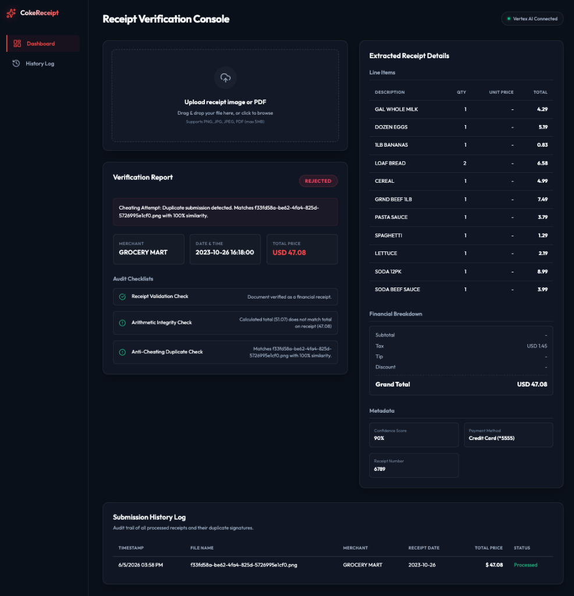
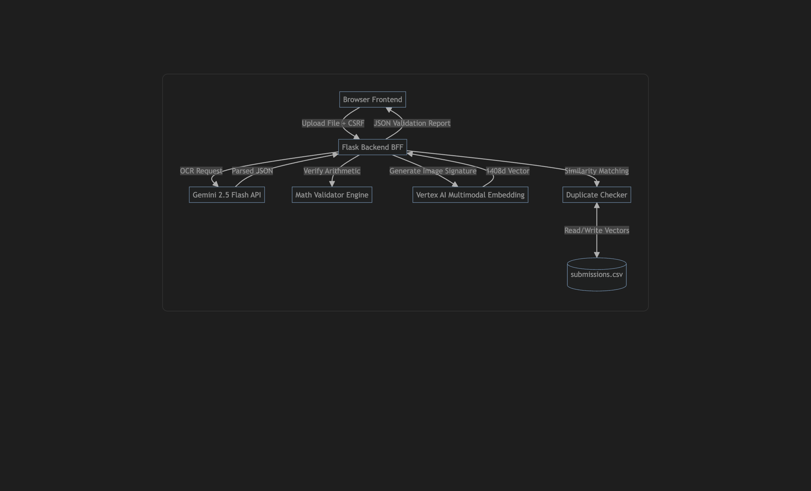
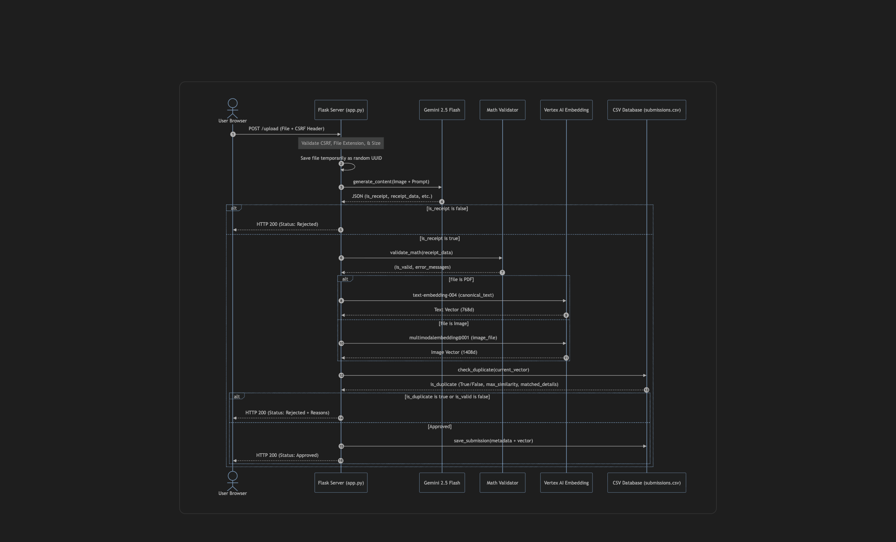

# Coke Receipt Validator & Anti-Cheating Console

A modern, secure web application designed to automate the validation of financial receipts. It combines document structure extraction via **Gemini 2.5 Flash**, arithmetic verification, and anti-cheating duplicate detection using **Multimodal Image Embeddings** via Google Cloud Vertex AI.



---

## Supported File Formats
- **Image Files**: `.png`, `.jpg`, `.jpeg` (processed via visual embeddings)
- **Document Files**: `.pdf` (processed via text embeddings fallback)
- **Maximum File Size**: **5MB** (enforced by server `MAX_CONTENT_LENGTH`)

---

## System Architecture

The application implements a Backend-for-Frontend (BFF) security pattern, ensuring all sensitive keys, files, and AI processing details remain protected on the server.



---

## Transaction Verification Flow

The sequence diagram below shows the end-to-end processing lifecycle of an uploaded receipt:



---

## Key Features

1. **AI OCR Data Extraction**: Uses **Gemini 2.5 Flash** to extract merchant data, transaction date/time, line items (quantity, unit price, total), financials (subtotal, tax, tip, discount, total), and payment method into a structured JSON schema.
2. **Arithmetic Validator**: Programs an audit check comparing the sum of line items to the subtotal, and validates the transaction balance:
   $$\text{Grand Total} = \text{Subtotal} + \text{Tax} + \text{Tip} - \text{Discount}$$
   *(discrepancies exceeding \$0.01 raise an audit alert)*
3. **Anti-Cheating Duplicate Detection**:
   - **Multimodal Visual Embeddings**: Generates a 1408-dimensional visual signature of receipt images using Vertex AI's `multimodalembedding@001` model. This detects if a user uploads the same physical receipt from a different angle or lighting to cheat.
   - **Text Embedding Fallback**: Generates a 768-dimensional text signature using `text-embedding-004` on a canonical representation of the transaction details for PDFs.
   - **Cosine Similarity Check**: Calculates similarity against historical submissions stored in a local CSV database (`submissions.csv`). Submissions with visual similarity $\ge 0.94$ (or text similarity $\ge 0.97$) are rejected.
4. **Premium Dashboard UI**: Responsive glassmorphism dark-theme dashboard featuring:
   - File Drop Zone (Drag & drop / click to browse) with size/type validation.
   - Real-time oscillating scanning beam animation.
   - Live audit reports (APPROVED / REJECTED badges with reason logs).
   - Detailed visual line items table and financial breakouts.
   - Audit trail submission log displaying past transactions.

---

## Technology Stack

- **Backend**: Flask (Python 3.13)
- **Generative AI SDKs**:
  - `google-genai` (Unified Google GenAI SDK for Gemini)
  - `google-cloud-aiplatform` (Vertex AI SDK for Multimodal Vision Embeddings)
- **Frontend**: Vanilla Javascript (ES6), custom CSS, Outfit web font, and Lucide icons.
- **Database**: Local CSV storage (`submissions.csv`).

---

## Setup & Running Locally

### 1. Prerequisites
- Python 3.13+
- Google Cloud SDK CLI installed.
- Active Google Cloud Project with the Vertex AI API enabled.

### 2. Configure GCP Credentials
Log in to establish your local Application Default Credentials (ADC) for Vertex AI access:
```bash
gcloud auth application-default login
```
*Note: Make sure your active GCP CLI project is configured. The application uses project `shade-sandbox` and location `us-central1` by default.*

### 3. Install Dependencies
Clone/navigate to the project directory and set up a virtual environment:
```bash
cd coke_receipt_demo
python3 -m venv .venv
source .venv/bin/activate
pip install --upgrade pip
pip install flask google-genai google-cloud-aiplatform python-dotenv pyopenssl
```

### 4. Run the Application
Start the Flask development server:
```bash
python app.py
```
By default, the server runs on:
`http://127.0.0.1:5000`
*(It listens strictly on localhost `127.0.0.1` to comply with local security protocols).*

---

## Security Implementations

This project enforces strict security standards to protect files, input states, and user sessions:

- **CSRF Protection**: Form actions verify the custom `X-CSRF-Token` header injected from the backend session state.
- **File Upload Security**:
  - Upload size limit is restricted to **5MB** via `MAX_CONTENT_LENGTH`.
  - Content types are checked against an allow-list: `{'png', 'jpg', 'jpeg', 'pdf'}`.
  - Uploaded files are renamed on the server to unique **UUID4** strings to prevent path traversal vulnerability vectors.
- **XSS Mitigation**: The frontend JavaScript avoids all unsafe DOM assignments (like `.innerHTML`). It uses `textContent` and `document.createElement` exclusively when populating receipt data.
- **Security Headers**: Custom HTTP filters append security headers to every response:
  - `X-Content-Type-Options: nosniff`
  - `X-Frame-Options: DENY` (anti-clickjacking guard)
  - Strict Content-Security-Policy (CSP) restricting scripts and styles to self-host and verified CDN origins.
